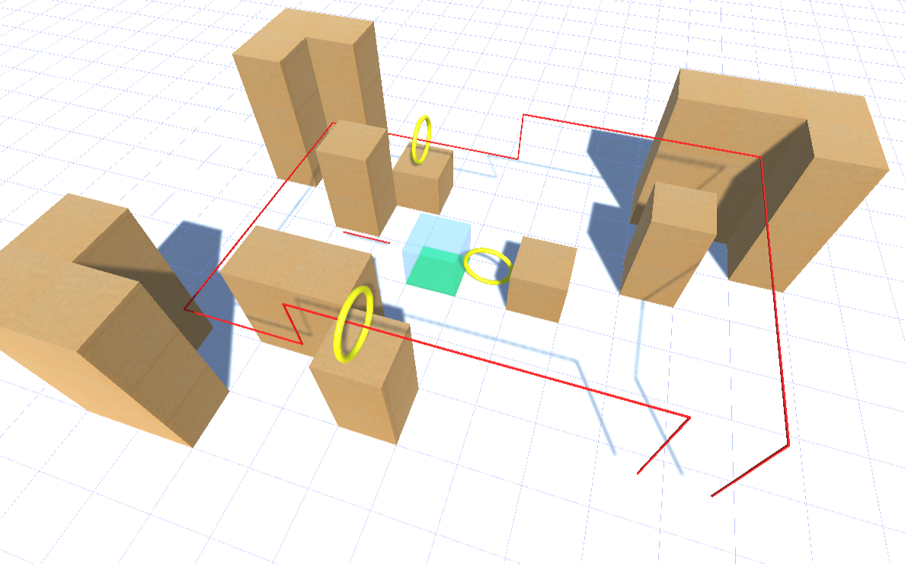
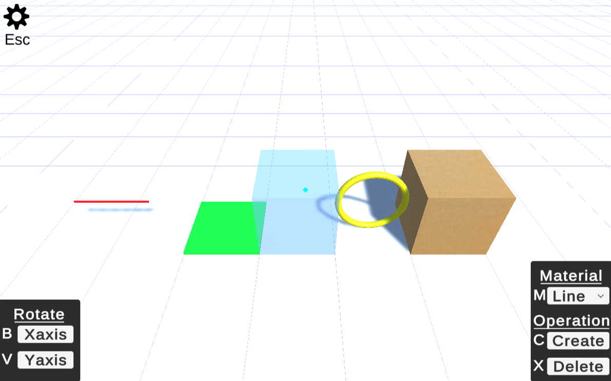

# Create3DDroneStage

# Description
Telloのドローンを用いる際にコースを仮想的に3Dで作成できるアプリケーション

Blockなどを生成し配置することによってコースを作成し,Lineを使って経路を示す想定

# Application
https://mitht0.github.io/Create3DDroneStage/

# Usage
### 操作
- 十字キーで前後左右に移動
- W,Sキーで上昇,下降
- A,Dキーで左右回転
- Q,Eキーで上下回転
- TabキーでUIの可視化,不可視化
- Escキーで操作方法,データのImport,Exportボタンを表示
### 生成
- Mキーで生成する素材の変更
- Cキーで青い透明なブロックがある地点に素材を生成
[Material一覧]

### 編集
- Xキーで青い透明なブロックがある地点のオブジェクトを消去
- Bキーで青い透明なブロックがある地点のオブジェクトをX軸回転
- Vキーで青い透明なブロックがある地点のオブジェクトをY軸回転
### データ
作成したコースを保存,生成することができる機能
- Importボタンを押すとJSONファイルが選択できるようになり,選択するとJSONファイルに書き込まれたコースデータを取り込み,コースを生成する
- Exportボタンを押すと今のコースデータがJSONデータでクリップボードにコピーされる

**注:Export機能を使う場合,JSONファイルは出力されないので自分自身で新しくJSONファイル(.json)を作成し,クリップボードにコピーされたJSONデータをそのファイルに張り付けて保存してください**

### コースの保存データ例
gitsave

# Environment
- Unity (Editor2021.3.13f1)
- WebGL
